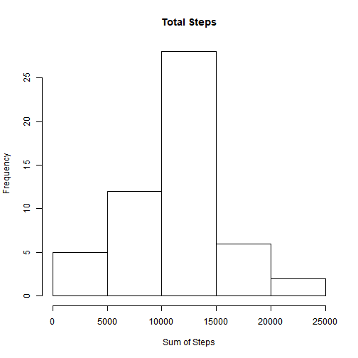
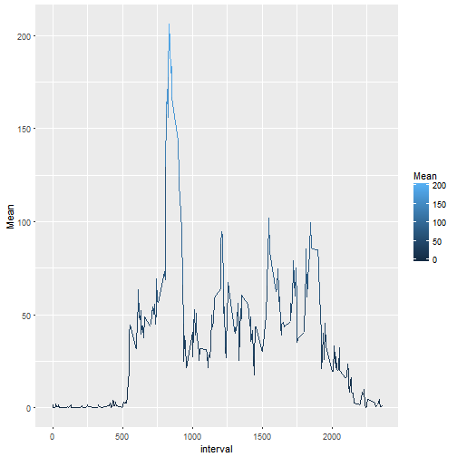
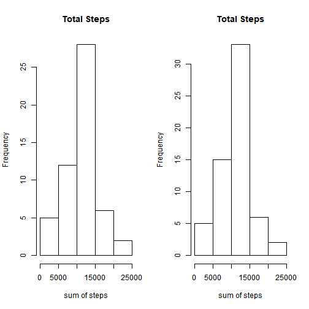
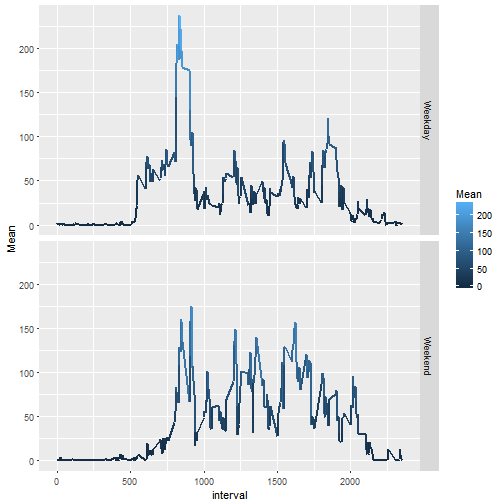

#Libraries required


```r
library(readr)
library(data.table)
library(ggplot2)
library(dplyr)
library(lubridate)
library(knitr)
library(kableExtra)
```

#Loading and preprocessing the data

1. **Using read_csv function from readr package to decrease the time required to load the data**


```r
data <- read_csv('activity.csv')
```

```
## Parsed with column specification:
## cols(
##   steps = col_integer(),
##   date = col_date(format = ""),
##   interval = col_integer()
## )
```

2. **Data.table function to convert it into datatable**


```r
data <- data.table(data)
```

3. **as.POSIXct to convert date into IST standard and adding a column for day on        the date**


```r
data$date <- as.POSIXct(data$date)
data$day <- weekdays(data$date)
```

- **How data looks**

```r
kable(data[1:15,]) %>% kable_styling()
```

```
## Currently generic markdown table using pandoc is not supported.
```


| steps|date                | interval|day    |
|-----:|:-------------------|--------:|:------|
|    NA|2012-10-01 05:30:00 |        0|Monday |
|    NA|2012-10-01 05:30:00 |        5|Monday |
|    NA|2012-10-01 05:30:00 |       10|Monday |
|    NA|2012-10-01 05:30:00 |       15|Monday |
|    NA|2012-10-01 05:30:00 |       20|Monday |
|    NA|2012-10-01 05:30:00 |       25|Monday |
|    NA|2012-10-01 05:30:00 |       30|Monday |
|    NA|2012-10-01 05:30:00 |       35|Monday |
|    NA|2012-10-01 05:30:00 |       40|Monday |
|    NA|2012-10-01 05:30:00 |       45|Monday |
|    NA|2012-10-01 05:30:00 |       50|Monday |
|    NA|2012-10-01 05:30:00 |       55|Monday |
|    NA|2012-10-01 05:30:00 |      100|Monday |
|    NA|2012-10-01 05:30:00 |      105|Monday |
|    NA|2012-10-01 05:30:00 |      110|Monday |

#What is mean total number of steps taken per day?

1. **Histogram of total no. of steps taken each day**


```r
histdata <- data[,sum(steps), by=date]
hist(histdata$V1, xlab = "Sum of Steps", main = 'Total Steps')
```



2. **Mean and Median total no. of steps taken per day is calculated using               data.table function and then kable function is used to display the this            table.**


```r
meanmediandata <- data[,list(mean(steps, na.rm = TRUE), median(steps)),by= date]
colnames(meanmediandata)[2] <- 'Mean'
colnames(meanmediandata)[3] <- "Median"
table <- meanmediandata[1:10,]
kable(table) %>% kable_styling()
```

```
## Currently generic markdown table using pandoc is not supported.
```


|date                |     Mean| Median|
|:-------------------|--------:|------:|
|2012-10-01 05:30:00 |      NaN|     NA|
|2012-10-02 05:30:00 |  0.43750|      0|
|2012-10-03 05:30:00 | 39.41667|      0|
|2012-10-04 05:30:00 | 42.06944|      0|
|2012-10-05 05:30:00 | 46.15972|      0|
|2012-10-06 05:30:00 | 53.54167|      0|
|2012-10-07 05:30:00 | 38.24653|      0|
|2012-10-08 05:30:00 |      NaN|     NA|
|2012-10-09 05:30:00 | 44.48264|      0|
|2012-10-10 05:30:00 | 34.37500|      0|


#What is the average daily activity pattern?

1. **Using the data.table function to calculate mean. Ggplot function is used to        plot the line graph for average daily activity pattern.**


```r
meandata <- data[,list(mean(steps, na.rm = TRUE)),by= c('interval')]
colnames(meandata)[2] <- 'Mean'
ggplot(meandata, aes(interval,Mean, color = Mean)) + geom_line()
```



2. **Using data.table function to calculate the max no. of steps in an interval.         Arrange function from dplyr package is used to arrange the data in descending       order.**


```r
sumdata <- data[,sum(steps, na.rm = TRUE),by=interval] %>% arrange(-V1)
sumdata[1,1]
```

```
## [1] 835
```


#Imputing missing values

1. **Total no. of missing values**


```r
count(subset(data, is.na(steps)))
```

```
## # A tibble: 1 x 1
##       n
##   <int>
## 1  2304
```

2. **To impute the missing values I have calculated the mean of the steps if            different intervals on different days. Then, I have filled these values in         place of missing values.**


```r
imputeddata <- data
mean_byday <- imputeddata[,list(mean(steps, na.rm = TRUE)),by= c('day', 'interval')]
colnames(mean_byday)[3] <- 'Mean'
for(i in 1:17568){
  if(is.na(imputeddata$steps[i])){
    tempvar <- subset(mean_byday, day == imputeddata$day[i] & interval == imputeddata$interval[i])$Mean
    imputeddata$steps[i] <- floor(tempvar)
  }
}
```
- **Previous data**


```r
kable(data[1:15,])%>% kable_styling()
```

```
## Currently generic markdown table using pandoc is not supported.
```


| steps|date                | interval|day    |
|-----:|:-------------------|--------:|:------|
|    NA|2012-10-01 05:30:00 |        0|Monday |
|    NA|2012-10-01 05:30:00 |        5|Monday |
|    NA|2012-10-01 05:30:00 |       10|Monday |
|    NA|2012-10-01 05:30:00 |       15|Monday |
|    NA|2012-10-01 05:30:00 |       20|Monday |
|    NA|2012-10-01 05:30:00 |       25|Monday |
|    NA|2012-10-01 05:30:00 |       30|Monday |
|    NA|2012-10-01 05:30:00 |       35|Monday |
|    NA|2012-10-01 05:30:00 |       40|Monday |
|    NA|2012-10-01 05:30:00 |       45|Monday |
|    NA|2012-10-01 05:30:00 |       50|Monday |
|    NA|2012-10-01 05:30:00 |       55|Monday |
|    NA|2012-10-01 05:30:00 |      100|Monday |
|    NA|2012-10-01 05:30:00 |      105|Monday |
|    NA|2012-10-01 05:30:00 |      110|Monday |
- **Imputed data**

```r
kable(imputeddata[1:15,]) %>% kable_styling()
```

```
## Currently generic markdown table using pandoc is not supported.
```


| steps|date                | interval|day    |
|-----:|:-------------------|--------:|:------|
|     1|2012-10-01 05:30:00 |        0|Monday |
|     0|2012-10-01 05:30:00 |        5|Monday |
|     0|2012-10-01 05:30:00 |       10|Monday |
|     0|2012-10-01 05:30:00 |       15|Monday |
|     0|2012-10-01 05:30:00 |       20|Monday |
|     5|2012-10-01 05:30:00 |       25|Monday |
|     0|2012-10-01 05:30:00 |       30|Monday |
|     0|2012-10-01 05:30:00 |       35|Monday |
|     0|2012-10-01 05:30:00 |       40|Monday |
|     0|2012-10-01 05:30:00 |       45|Monday |
|     0|2012-10-01 05:30:00 |       50|Monday |
|     0|2012-10-01 05:30:00 |       55|Monday |
|     0|2012-10-01 05:30:00 |      100|Monday |
|     0|2012-10-01 05:30:00 |      105|Monday |
|     0|2012-10-01 05:30:00 |      110|Monday |


3. **Histogram of previous and new data **


```r
histdata <- data[,sum(steps), by=date]
histdata1 <- imputeddata[,sum(steps), by=date]
par(mfrow = c(1,2))
hist(histdata$V1, xlab = "sum of steps", main = "Total Steps")
hist(histdata1$V1, xlab = "sum of steps", main = "Total Steps")
```



```r
par(mfrow = c(1,1))
```

4. **Mean and Median values after imputing the values**


```r
meanmediandata <- imputeddata[,list(mean(steps), median(steps)),by= date]
colnames(meanmediandata)[2] <- 'Mean'
colnames(meanmediandata)[3] <- "Median"
kable(meanmediandata[1:10,]) %>% kable_styling()
```

```
## Currently generic markdown table using pandoc is not supported.
```


|date                |     Mean| Median|
|:-------------------|--------:|------:|
|2012-10-01 05:30:00 | 34.33333|      8|
|2012-10-02 05:30:00 |  0.43750|      0|
|2012-10-03 05:30:00 | 39.41667|      0|
|2012-10-04 05:30:00 | 42.06944|      0|
|2012-10-05 05:30:00 | 46.15972|      0|
|2012-10-06 05:30:00 | 53.54167|      0|
|2012-10-07 05:30:00 | 38.24653|      0|
|2012-10-08 05:30:00 | 34.33333|      8|
|2012-10-09 05:30:00 | 44.48264|      0|
|2012-10-10 05:30:00 | 34.37500|      0|

#Are there differences in activity patterns between weekdays and weekends?

1. **Creating a new factor in the imputed dataset**


```r
day_type <- factor(c("Weekday"), levels = c("Weekday", "Weekend"))
for(i in 1:17568){
  if(imputeddata$day[i] == "Saturday" | imputeddata$day[i] == "Sunday"){
    day_type[i] <- "Weekend"
  }
  else{
    day_type[i] <- "Weekday"
  }
}
imputeddata <- cbind(imputeddata,day_type)
```

2. **Plotting the dataset according to the day_type**


```r
meandatabyweekday <- imputeddata[,mean(steps), by = c('day_type','interval')]
colnames(meandatabyweekday)[3] <- 'Mean'
ggplot(meandatabyweekday, aes(interval, Mean, color = Mean)) + geom_line(size = 1) + facet_grid(day_type ~ .)
```




